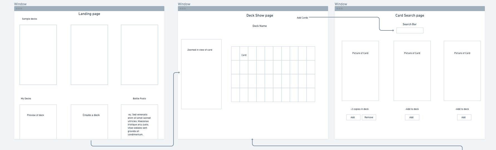

<h1>Yugi's World </h1>

My Yugioh deck building app allows a user to create multiple decks by using an API to search for information on Yugioh cards. This can be useful for keeping track of what cards you would want in your deck

<h1>Getting Started: </h1>

Link to Yugi's World: <a>https://kaiba-corp-yugis-world.herokuapp.com/</a>
<ul>
<li> Log in with your Google account </li>
<li> Create a Deck(s) </li>
<li> Use the search bar to search for some cards to add to your deck </li>
<li> If you need ideas of what to add to your deck(s) you can look at you friend's decks </li>
<li> You have the option to add and remove friends from your friend's list</li>
<li> After your created and added cards to your deck(s), you can post or reply on the message board and get more ideas of what decks you want to make</li>
</ul>

Trello Board:

<h1> Screenshot(s):</h1>
Landing Page:

ERD:

Wireframes:

Message Board:

Profile Show Page:

Deck Index Page:

<h1> Technologies Used:</h1>
<ul>
<li>HTML</li>
<li>CSS</li>
<li>Javascript</li>
<li>Node.js</li>
<li>Mongoose</li>
<li>MongoDb</li>
<li>Google OAuth 2.0</li>
<li>Bootstrap </li>
</ul>

<h1> Next Steps:</h1>
<ul>
<li>create an api that will export the user's decks to an online dueling website (<a>https://www.duelingbook.com/</a>) , so you can actually use the deck you built using this app to duel</li>
<li>create functionality collection of cards, so the user can create deck(s) using their own cards</li>
<li>create functionality so the user can "open" a pack of cards and get random cards to add to their collection</li>
<li>add a users favorite's cards list</li>
<li>create sample decks so users can get ideas of what cards to add to their deck(s)</li>
</ul>